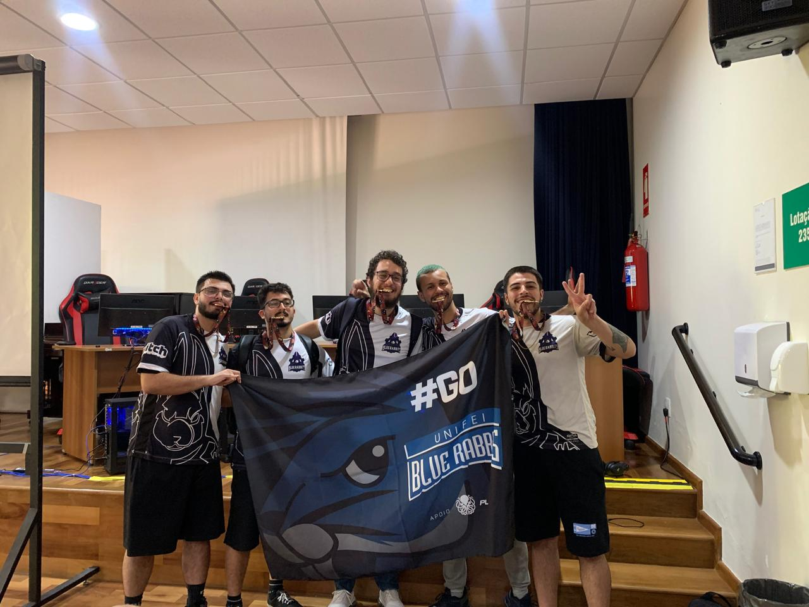

# Apresentação João Guilherme

Fala turma, beleza? Bom, eu sou o João mas o pessoal me chama de Alvarenga (**que é o meu sobrenome**) ou de Alva. Tenho 25 anos e sou nativo da cidade de Pouso Alegre - MG. Atualmente estou matriculado no primeiro semestre de Sistemas de Informação mas estou na Unifei desde 2022. Eu moro em uma república com mais 4 bobões e é até que muito divertido. Falando mais sobre meus gostos, desde pequeno estive envolvido na área dos esportes (**o famoso joga de tudo mas não é bom em nada**) e, por volta dos 8 anos de idade meu irmão mais velho me apresentou os famosos joguinhos onlines. Desde então, os jogos são um dos meus hobbies favoritos. Atualmente eu jogo um lolzinho (**infelizmente**) e sou o atual suporte e capitão do time de lol aqui da UNIFEI. Gosto muito (**tipo muito mesmo**) de música e tento desenrolar um pouco no violão. Gosto bastante de assistir séries e também de alguns animes. Diria que eu sou uma bela mistura de nerd com um cara que ama estar fora de casa (**nem sei como isso combina**).

##Esse é o nosso time de lol no JUTEL (Jogos do Inatel) do ano passado e eu sou o carinha da direita
 
 

Puxando para o lado acadêmico/profissional, realizei meu ensino médio no Instituto Federal de Pouso Alegre juntamente do curso técnico em informática, lá tive meus primeiros contatos com linguagens de programação, banco de dados e redes. Após me formar, entrei no curso de Engenharia de Materiais na UNIFEI no ano de 2020 mas, com a pandemia acabei não vindo para Itajubá e optei por trancar meu curso e ir dar a famosa estreada na CLT. Em 2020 comecei minha carreira na área de Redes em uma empresa de Internet em Pouso Alegre, após um curto tempo migrei para outra empresa, onde além de atuar no suporte técnico ao cliente (**o próprio cara que pede pra reiniciar o modem**), também comeceii a trabalhar com monitoramento de rede e configuração de equipamentos. Por fim, na metade do ano de 2022 migrei novamente para uma nova empresa do ramo onde minha função era mais voltada para o monitoramento da rede. Em 2022 com o fim da pandemia vim então para Itajubá e dei inicio ao curso. Como já tinha a intenção de migrar para o curso de Sistemas, consegui adiantar algumas matérias e tive o deferimento delas nas equivalências. Atualmente estou encerrando um estágio na Prefeitura de Itajubá e, ao mesmo tempo estou muito contente de estar realizando o processo de Treinee da byron. A curiosidade sobre a área de engenharia de software e de gerenciamento de projetos é algo que me empolga muito e me faz correr atrás de novos conhecimentos.

No geral, sou um cara que ama conhecer novas pessoas e ter novas experiências e sou apelidado como um belo de um matraca. Esse é um pequeno resuminho sobre quem é o João e, a caso quem interessa, estarei sempre aberto a uma boa resenha. 

(**Uma ultima curiosidade: Eu sou surdo do ouvido esquerdo, mas essa história eu deixo para contar para quem vier me perguntar pessoalmente**)

